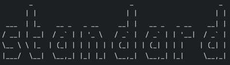
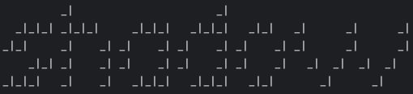
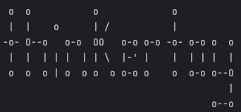

# ascart

ascart is a tool for converting strings of text to ASCII art, and vice versa. It can colorize the entire text, or specified letters, save the output to a specified file, text align the output, and convert an ascii art file into a string.

---
### Standard output:
ascart [STRING] outputs the entered string using the standard ascii art style.
e.g.
> % `ascart "Hello"`

ascart [STRING] [BANNER] outputs the entered string using the specified ascii art style.
e.g.
> % `ascart "Hello" shadow`

Available styles are **standard**, **shadow**, and **thinkertoy**.
>   
> 
> 

### Available flags:
#### color
--color=[value] [STRING] outputs the entire text in the specified colour.
e.g.
> % `ascart --color=blue "Hello"`

--color=[value] [LETTERS] [STRING] outputs the every instance of the given letters in the specified colour.
e.g.
> % `ascart --color=red hel "Hello"`

(ell are printed in red) Available colors are **red**, **green**, **yellow**, **orange**, and **blue**.

#### output

--output=[filename.txt] [STRING] outputs the string and saves it to the specified file.
e.g.
> % `ascart --output="art.txt" "Hello"`

outputs the entered string using the standard ascii art style, and saves it as art.txt.

--output=[filename.txt] [STRING] [BANNER] outputs the string in the specified style and saves it to the specified file.
e.g.
> % `ascart --output="art.txt" "Hello" thinkertoy`

outputs the entered string using the thinkertoy ascii art style, and saves it as art.txt.

#### align

--align=[type] [STRING] [BANNER] outputs the string in the specified alignment.
e.g.
> % `ascart --align=justify "Hello" thinkertoy`

outputs the entered string using the thinkertoy ascii art style, aligned to both edges of the terminal.
Available options are **left**, **right**, **center**, and **justify**.

#### reverse

--reverse=[filename] takes an ascii art file and prints the content to the terminal as a string of characters.
e.g.
> % `ascart --reverse textfile.txt`

takes the ascii art in the file textfile.txt and returns the content as a string of characters in the terminal.
